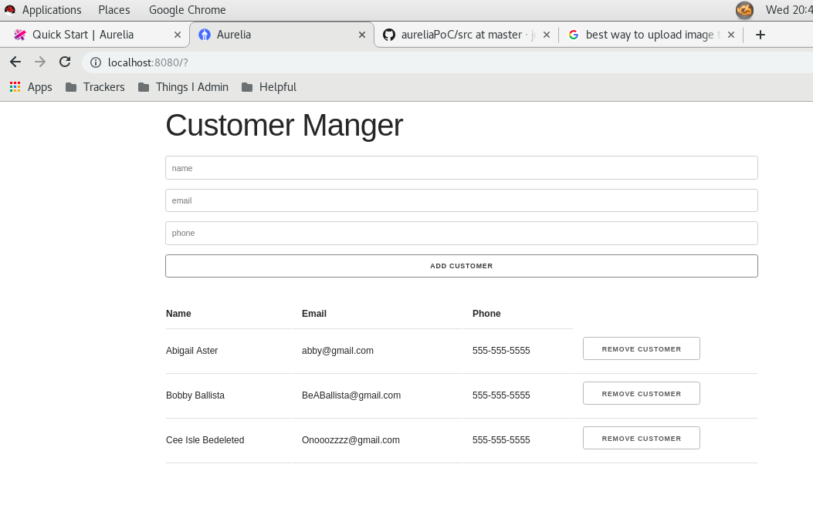

# aureliaPoC
Proof of concept to make my first Aurelia project

following along with
https://www.youtube.com/watch?v=yaX34x3OgQI

Managed to remove 10 lines of clutter code from app.js

preview using html img tag:

markdown preview
